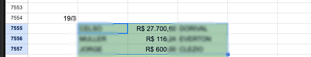
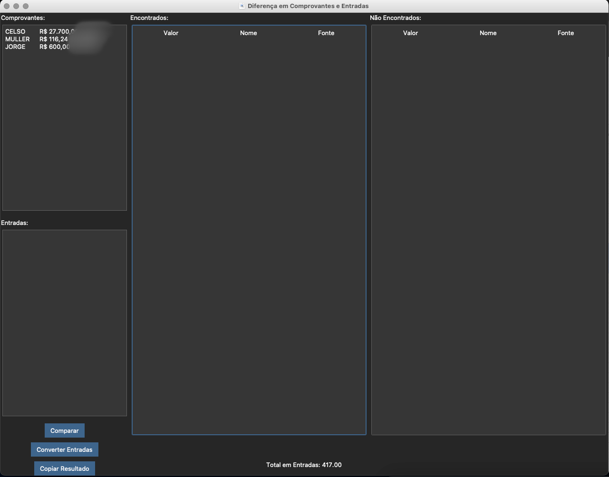
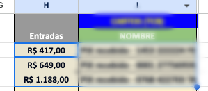
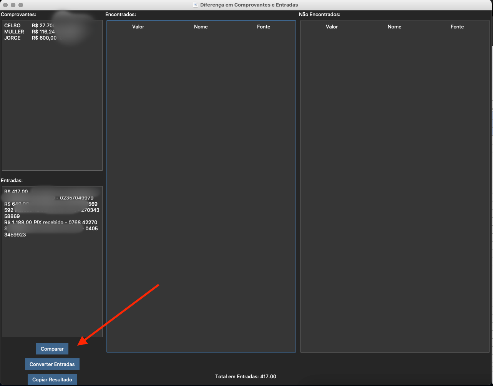
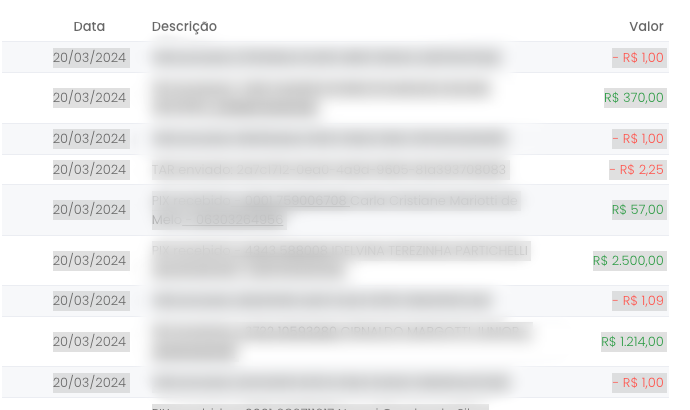
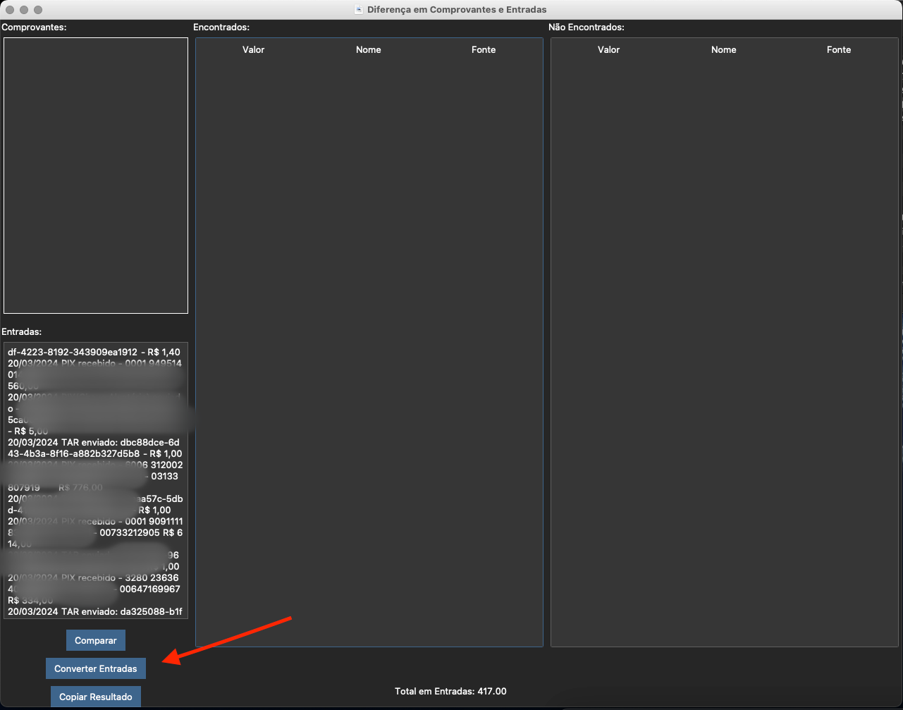

# TCB Digital - Ferramenta para IN188

## Comparação de Entradas e Comprovantes:

1 - Selecione e Copie os Comprovantes:

2 - Cole-os no campo "Comprovantes":

3 - Faça o mesmo com as entradas:

4 - Cole-as no campo "Entradas":

### Clique no botão "Comparar" e aguarde a comparação ser concluída. Ao concluir, clique em "Copiar Resultado"

 
 

## Conversão de Entradas do Extrato para Entradas da Planilha:

1 - Selecione as Entradas no Extrato:

2 - Cole-as no campo "Entradas" e clique em Converter Entradas:

### Ao finalizar as entradas estarão em sua área de transferência. Basta colar aonde quiser agora!